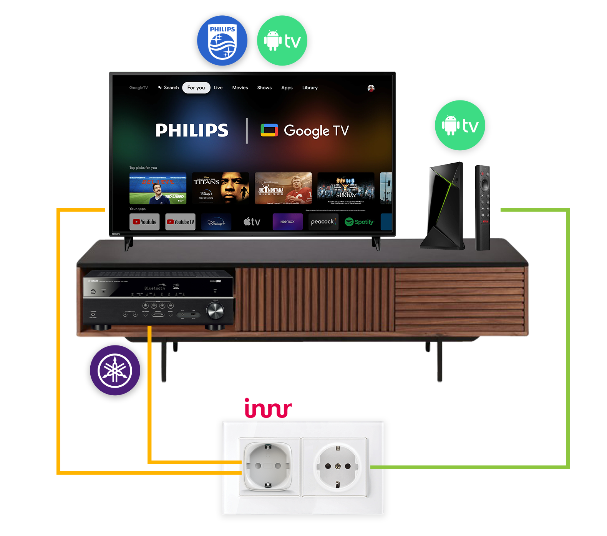
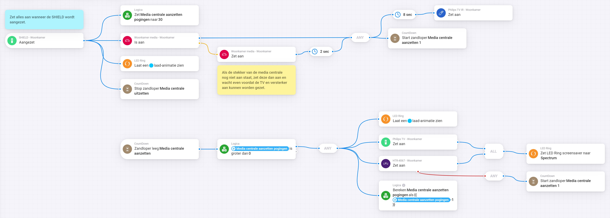
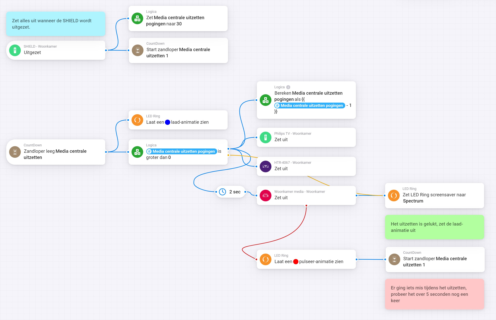

# Energie besparen

## Introductie

In onze moderne huishoudens zijn mediastations zoals de NVIDIA Shield, Smart TV's en versterkers niet meer weg te denken. Echter, wist je dat de meeste apparaten zelfs in stand-by modus nog aanzienlijke hoeveelheden energie verbruiken?&#x20;

Gelukkig is er een slimme oplossing die je kan helpen om sluipverbruik te voorkomen. Hiermee bespaar je niet alleen energie en kosten, maar behoud je ook het gemak. Met slechts één druk op de knop van de NVIDIA Shield afstandsbediening schakel je alles in, en met dezelfde eenvoud zet je alles weer uit.

In dit artikel laten we zien hoe je met behulp van de Android TV app voor Homey en een NVIDIA Shield jouw mediastation energiezuiniger maakt.

<figure><figcaption></figcaption></figure>

### Benodigdheden

* Homey Pro
* NVIDIA Shield met de Android TV app
* Philips TV met de Android TV en Philips TV apps
* Yamaha versterker met de Yamaha app
* Slimme stekker (bijvoorbeeld van INNR)

### Hoe het werkt

De sleutel tot het voorkomen van sluipverbruik ligt in de samenwerking tussen Homey, de Android TV app en de slimme stekker.

**Stap 1: Installatie en Koppeling**

Zorg ervoor dat de Philips TV app voor Homey, evenals de Yamaha app, correct geïnstalleerd en gekoppeld zijn aan je apparaten.

**Stap 2: Slimme Stekker Plaatsen**

Sluit de slimme stekker aan op het stopcontact en verbind deze met je televisie en versterker. Dit wordt de schakel tussen het mediastation en de stroomvoorziening.

**Stap 3: Automatisering instellen**

Via Homey kun je nu een automatisering instellen die ervoor zorgt dat wanneer de NVIDIA Shield wordt aangezet, de slimme stekker wordt geactiveerd. Hierdoor krijgen de televisie en versterker stroom.

**Stap 4: Infrarood Signaal voor de TV**

De Philips TV app voor Homey maakt gebruik van een infrarood signaal om de televisie aan te zetten. Dit wordt automatisch geactiveerd wanneer de NVIDIA Shield opstart.

**Stap 5: Yamaha App voor de Versterker**

Met behulp van de Yamaha app, wordt je versterker aangezet, selecteert je het juiste input kanaal en stel je het volume in op een standaard niveau.

### Besparingen en Jaarlijkse Berekening:

Sluipverbruik van televisies die in stand-by staan kan oplopen tot wel 50 tot 100 watt, afhankelijk van het model. Door deze apparaten volledig uit te schakelen wanneer ze niet in gebruik zijn, kun je aanzienlijke besparingen realiseren.

Laten we een voorbeeld nemen: stel dat je mediastation gemiddeld 8 uur per dag aan staat. Met een sluipverbruik van 75 watt zou je per dag 1,2 kWh verbruiken. Op jaarbasis komt dit neer op 438 kWh. Met een gemiddelde elektriciteitsprijs van 0,25 euro per kWh, zou je jaarlijks zo'n 109,5 euro besparen.

### Conclusie

Met de Android TV app voor Homey en een slimme stekker kun je op een eenvoudige manier sluipverbruik voorkomen en flink besparen op je energierekening. Door deze slimme oplossing toe te passen, draag je niet alleen bij aan een groenere toekomst, maar houd je ook nog wat extra geld over in je portemonnee.

### Gedetailleerde flows

Hieronder vind je een voorbeeld van hoe je de flows voor het aan- en uitzetten kunt instellen.

<figure><figcaption>
Media centrale aanzetten
</figcaption></figure>

<figure><figcaption>
Media centrale uitzetten
</figcaption></figure>
